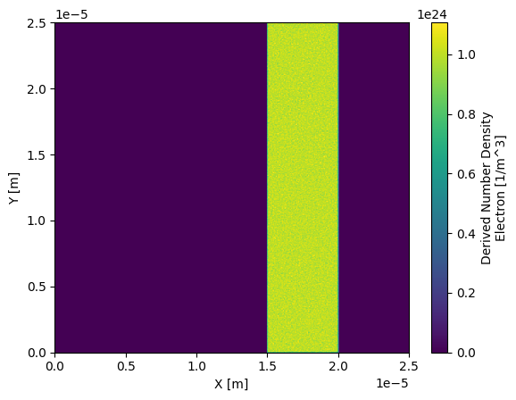
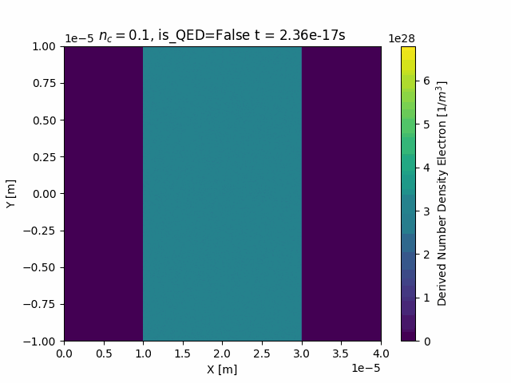

  
*Original logo produced by Oscar Adams CC BY-SA 4.0*

**BEAM** (Broad EPOCH Analysis Modules) is a collection of independent yet complementary open-source tools for analysing EPOCH simulations in Python, designed to be modular so researchers can adopt only the components they require without being constrained by a rigid framework. In line with the **FAIR principles — Findable**, **Accessible**, **Interoperable**, and **Reusable** — each package is openly published with clear documentation and versioning (Findable), distributed via public repositories (Accessible), designed to follow common standards for data structures and interfaces (Interoperable), and includes licensing and metadata to support long-term use and adaptation (Reusable). The packages are as follows:

- [sdf-xarray](https://github.com/epochpic/sdf-xarray): Reading and processing SDF files and converting them to [xarray](https://docs.xarray.dev/en/stable/).
- [epydeck](https://github.com/epochpic/epydeck): Input deck reader and writer.
- [epyscan](https://github.com/epochpic/epyscan): Create campaigns over a given parameter space using various sampling methods.


Originally developed by Joel Adams and the [PlasmaFAIR](https://plasmafair.github.io) Team at the York Plasma Institute under the EPSRC Grant EP/V051822/1.

## Installation {#installation}

All of the packages are available on PyPI and can be installed using pip:

```bash
pip install sdf-xarray epydeck epyscan
```

Each package can be used independently or together depending on your needs.

## Citing {#citing}

If any of the BEAM contribute to a project that leads to publication, please acknowledge this by citing the module in question. This can be done by clicking the "cite this repository" button located near the top right of their respective github pages.

## sdf-xarray: analysing EPOCH output {#sdf-xarray}

`sdf-xarray` is a lightweight wrapper that reads EPOCH's SDF files into `xarray.Dataset` objects. This provides:

- Lazy loading and memory-efficient handling of large datasets
- Easy slicing and plotting using `matplotlib`, `xarray.plot`, or `hvplot`
- Automatic normalisation of grid and variable names
- Integration with Jupyter notebooks and Dask for parallel analysis

**The key features for this module are highlighted below, for in-depth documentation please visit <https://sdf-xarray.readthedocs.io>**

### Single file loading {#single_file_loading}

```python
import xarray as xr

ds = xr.open_dataset("0010.sdf")

ds["Electric_Field_Ex"]

# <xarray.DataArray 'Electric_Field_Ex' (X_x_px_deltaf_electron_beam: 16)> Size: 128B
# [16 values with dtype=float64]
# Coordinates:
#   * X_x_px_deltaf_electron_beam  (X_x_px_deltaf_electron_beam) float64 128B 1...
# Attributes:
#     units:    V/m
#     full_name: "Electric Field/Ex"
```

### Multi file loading {#multi_file_loading}

To open a whole simulation at once, pass `preprocess=sdf_xarray.SDFPreprocess()`
to `xarray.open_mfdataset`:

```python
import xarray as xr
from sdf_xarray import SDFPreprocess

ds = xr.open_mfdataset("*.sdf", preprocess=SDFPreprocess())

print(ds)

# Dimensions:
# time: 301, X_Grid_mid: 128, ...
# Coordinates: (9) ...
# Data variables: (18) ...
# Indexes: (9) ...
# Attributes: (22) ...
```

`SDFPreprocess` checks that all the files are from the same simulation, as
ensures there's a `time` dimension so the files are correctly concatenated.

If your simulation has multiple `output` blocks so that not all variables are
output at every time step, then those variables will have `NaN` values at the
corresponding time points.

After having loaded in a series of datasets we can select a simulation file by calling the `.isel()` function where we pass in the parameter of `time=0` where `0` can be a number between `0` and the total number of simulation files. 

We can also use the `.sel()` function if we know the exact simulation time we want to select. There must be a corresponding dataset with this time for it work correctly.

```python
print(f"There are a total of {ds["time"].size} time steps. (This is the same as the number of SDF files in the folder)")
# There are a total of 41 time steps. (This is the same as the number of SDF files in the folder)

print(f"The time steps are: {ds["time"].values}")
# The time steps are: [2.60596949e-17 5.00346143e-15 1.00069229e-14, ..., 2.00034218e-13]

sim_time = ds['time'].isel(time=20).values
print(f"The time at the 20th simulation step is {sim_time:.2e} s")
# The time at the 20th simulation step is 1.00e-13 s

ds["Electric_Field_Ex"].isel(time=20)
# OR
# ds["Electric_Field_Ex"].sel(time=sim_time)
```

### Plotting {#plotting}

Since this package converts SDF files to xarray we can leverage the plotting features that are included in xarray. For example we can load in a SDF file and plot the number density of the electrons:

```python
import xarray as xr

ds = xr.open_dataset("0010.sdf")

# NOTE: EPOCH saves the x and y axes into SDF files in the inverse order to that expected by xarray so we have to specify which axes is which otherwise our plot comes out inverted
ds["Derived_Number_Density_Electron"].plot(x="X_Grid_mid", y="Y_Grid_mid")
```



### Animating {#animating}

This package also contains custom functionality to generate time-resolved animations by loading in all the SDF files in a given simulation run:

```python
import xarray as xr
from sdf_xarray import SDFPreprocess

ds = xr.open_mfdataset("*.sdf", preprocess=SDFPreprocess())

ani = ds["Derived_Number_Density_Electron"].epoch.animate()

ani.save("Derived_Number_Density_Electron.gif", fps=5)
```



## epydeck: Writing input deck files with Python {#epydeck}

Writing large numbers of EPOCH input files by hand can be tedious and error-prone. `epydeck` (short for *EPOCH Python deck*) allows you to create and manipulate input decks in Python:

- Build decks using standard Python data structures
- Load, modify, and save EPOCH-style `.deck` files
- Designed to preserve comments and formatting where possible

The interface follows the standard Python
[`json`](https://docs.python.org/3/library/json.html) module:

- `epydeck.load` to read from a `file` object
- `epydeck.loads` to read from an existing string
- `epydeck.dump` to write to a `file` object
- `epydeck.dumps` to write to a string


**The key features for this module are highlighted below, for in-depth documentation please visit, for in-depth documentation please visit <https://github.com/epochpic/epydeck>**


### Example {#epydeck_example}

```python
import epydeck

# Read from a file with `epydeck.load`
with open(filename) as f:
    deck = epydeck.load(f)

print(deck.keys())
# dict_keys(['control', 'boundaries', 'constant', 'species', 'laser', 'output_global', 'output', 'dist_fn'])

# Modify the deck as a usual python dict:
deck["species"]["proton"]["charge"] = 2.0

# Write to file
with open(filename, "w") as f:
    epydeck.dump(deck, f)

print(epydeck.dumps(deck))
# ...
# begin:species
#   name = proton
#   charge = 2.0
#   mass = 1836.2
#   fraction = 0.5
#   number_density = if((r gt ri) and (r lt ro), den_cone, 0.0)
#   number_density = if((x gt xi) and (x lt xo) and (r lt ri), den_cone, number_density(proton))
#   number_density = if(x gt xo, 0.0, number_density(proton))
# end:species
# ...
```

## epyscan: Campaign generation and parameter sampling {#epyscan}

`epyscan` (short for *EPOCH Python scan*) generates [EPOCH](https://epochpic.github.io/) campaigns over a parameter space using different sampling methods. It supports the following features:

- Defining scans over one or more input variables
- Support for grid and Latin hypercube sampling methods

Parameter space to be sampled is described by a `dict` where keys
should be in the form of `block_name:parameter`, and values should
be dicts with the following keys:

- `"min"`: minimum value of the parameter
- `"max"`: maximum value of the parameter
- `"log"`: (optional) `bool`, if `True` then grid is done in
  log space for this parameter

**The key features for this module are highlighted below, for in-depth documentation please visit, for in-depth documentation please visit <https://github.com/epochpic/epyscan>**

### Example {#epyscan_example}

```python
import pathlib
import epyscan
import epydeck

# Define the parameter space to be sampled. Here, we are varying the intensity
# and density
parameters = {
  # Intensity varies logarithmically between 1.0e22 and 1.0e24
  "constant:intens": {"min": 1.0e22, "max": 1.0e24, "log": True},
  # Density varies logarithmically between 1.0e20 and 1.0e24
  "constant:nel": {"min": 1.0e20, "max": 1e24, "log": True},
}

# Load a deck file to use as a template for the simulations
with open("template_deck_filename") as f:
  deck = epydeck.load(f)

# Create a grid scan object that will generate 4 different sets of parameters 
# within the specified ranges
grid_scan = epyscan.GridScan(parameters, n_samples=4)

# Define the root directory where the simulation folders will be saved. 
# This directory will be created if it doesn't exist
run_root = pathlib.Path("example_campaign")

# Initialize a campaign object with the template deck and the root directory. 
# This will manage the creation of simulation cases
campaign = epyscan.Campaign(deck, run_root)

# Generate the folders and deck files for each set of parameters in the
# grid scan
paths = [campaign.setup_case(sample) for sample in grid_scan]

# Save the paths of the generated simulation folders to a file
with open("paths.txt", "w") as f:
  [f.write(f"{path}\n") for path in paths]

# Opening paths.txt
# example_campaign/run_0_1000000/run_0_10000/run_0_100/run_0
# example_campaign/run_0_1000000/run_0_10000/run_0_100/run_1
# example_campaign/run_0_1000000/run_0_10000/run_0_100/run_2
# ...
```